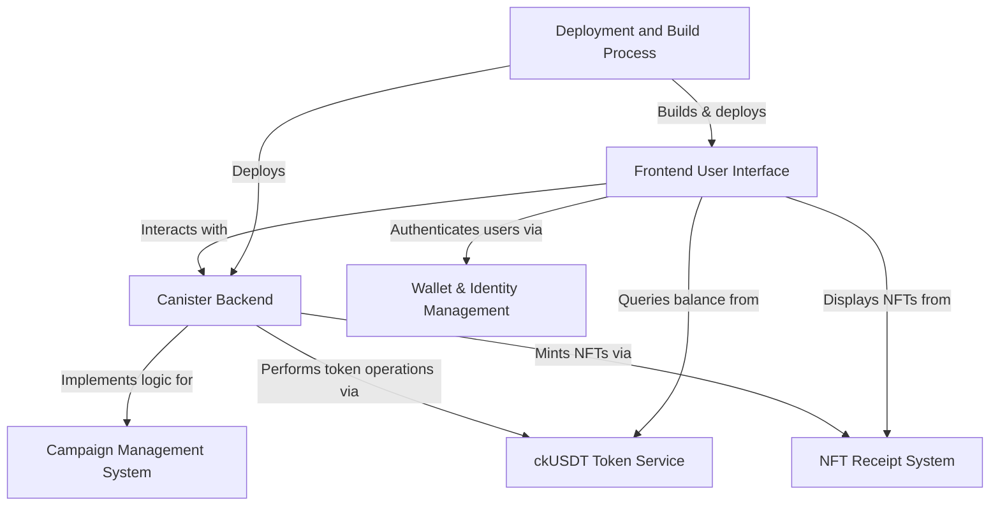

# Cryptocause - Web3 Charity dApp on ICP

A decentralized crypto-charity donation platform built on the Internet Computer Protocol (ICP) using ckUSDT tokens for transparent, secure, and efficient charitable giving.
 It enables users to create and manage charity campaigns, make transparent donations using **ckUSDT stablecoin**, and receive unique **NFT receipts** as proof of their contributions, all managed securely on-chain.


## Visual Overview



## 🌟 Features

- **💰 ckUSDT Donations**: Stable token donations with low fees
- **🔗 Blockchain Transparency**: All donations recorded on-chain
- **🎯 Campaign Management**: Create and manage charity campaigns
- **🏆 NFT Receipts**: Unique NFT proof of donation
- **🔒 Secure Escrow**: Milestone-based fund release
- **📊 Real-time Dashboard**: Track donations and impact
- **🌐 Web3 Wallet Integration**: Internet Identity, Plug, Stoic support

## 🏗️ Architecture

### Backend (Motoko Canisters)
- **Donation Canister**: Core donation logic and campaign management
- **NFT Canister**: ICRC-721 compliant donation receipt NFTs
- **ckUSDT Integration**: ICRC-1 token standard support

### Frontend (React + TypeScript)
- **Modern UI**: Tailwind CSS with responsive design
- **Wallet Integration**: Multiple wallet provider support
- **Real-time Updates**: Live donation tracking
- **Campaign Discovery**: Browse and search campaigns

## 🚀 Quick Start

### Prerequisites
- [DFX](https://internetcomputer.org/docs/current/developer-docs/setup/install/) >= 0.15.0
- [Node.js](https://nodejs.org/) >= 16.0.0
- [npm](https://www.npmjs.com/) or [yarn](https://yarnpkg.com/)

### Installation

1. **Clone the repository**
   ```bash
   git clone <repository-url>
   cd charity-dapp-icp
   ```

2. **Install dependencies**
   ```bash
   npm install
   ```

3. **Start the local Internet Computer replica**
   ```bash
   dfx start --background
   ```

4. **Deploy canisters locally**
   ```bash
   dfx deploy
   ```

5. **Start the frontend development server**
   ```bash
   npm run serve
   ```

6. **Open your browser**
   Navigate to `http://localhost:3000`

## 📁 Project Structure

```
charity-dapp-icp/
├── src/
│   ├── donation_canister/          # Main donation logic
│   │   └── main.mo
│   ├── nft_canister/               # NFT receipt system
│   │   └── main.mo
│   └── charity_frontend/           # React frontend
│       ├── src/
│       │   ├── components/         # Reusable UI components
│       │   ├── contexts/           # React contexts
│       │   ├── pages/              # Page components
│       │   ├── services/           # API services
│       │   └── types/              # TypeScript types
│       └── public/
├── dfx.json                        # DFX configuration
├── package.json                    # Node.js dependencies
└── README.md
```

## 🔧 Development Commands

| Command | Description |
|---------|-------------|
| `npm run build` | Build the frontend |
| `npm run dev` | Deploy and start development server |
| `npm run serve` | Start frontend development server |
| `dfx deploy --network local` | Deploy to local network |
| `dfx deploy --network ic` | Deploy to IC mainnet |

## 🏛️ Smart Contract Functions

### Donation Canister
- `createCampaign()` - Create a new charity campaign
- `donate()` - Make a donation to a campaign
- `getDonations()` - Get donations for a campaign
- `withdraw()` - Withdraw funds (campaign owner only)
- `getTotalStats()` - Get platform statistics

### NFT Canister
- `mintDonationNFT()` - Mint NFT receipt for donation
- `tokenMetadata()` - Get NFT metadata
- `tokensOf()` - Get NFTs owned by user
- `transfer()` - Transfer NFT ownership

## 💰 ckUSDT Integration

This dApp uses ckUSDT (Chain-key USDT) for donations:
- **Stability**: Pegged to USD value
- **Low Fees**: Minimal transaction costs on ICP
- **Fast Transactions**: Near-instant settlement
- **Cross-chain**: Bridged from Ethereum USDT

## 🔐 Security Features

- **Identity Verification**: Internet Identity integration
- **On-chain Validation**: All transactions verified on blockchain
- **Escrow System**: Funds held until milestones met
- **Audit Trail**: Complete transaction history
- **Access Control**: Role-based permissions

## 🎨 UI/UX Features

- **Responsive Design**: Mobile-first approach
- **Dark/Light Mode**: User preference support
- **Real-time Updates**: Live donation tracking
- **Accessibility**: WCAG 2.1 compliance
- **Performance**: Optimized loading and caching

## 🌐 Deployment

### Local Development
```bash
# Start local replica
dfx start --background

# Deploy canisters
dfx deploy

# Start frontend
npm run serve
```

### Testnet Deployment
```bash
# Deploy to IC testnet
dfx deploy --network ic --wallet $(dfx identity get-wallet)
```

### Mainnet Deployment
```bash
# Deploy to IC mainnet
dfx deploy --network ic --with-cycles 1000000000000
```

## 📊 Monitoring & Analytics

- **Transaction Tracking**: Monitor all donations
- **Campaign Analytics**: Track campaign performance
- **User Metrics**: Understand user behavior
- **Financial Reporting**: Generate donation reports

## 🤝 Contributing

1. Fork the repository
2. Create a feature branch (`git checkout -b feature/amazing-feature`)
3. Commit your changes (`git commit -m 'Add amazing feature'`)
4. Push to the branch (`git push origin feature/amazing-feature`)
5. Open a Pull Request

## 📄 License

This project is licensed under the MIT License - see the [LICENSE](LICENSE) file for details.

## 🆘 Support

- **Documentation**: [Internet Computer Docs](https://internetcomputer.org/docs/)
- **Community**: [IC Discord](https://discord.gg/internetcomputer)
- **Issues**: [GitHub Issues](https://github.com/your-repo/issues)

## 🙏 Acknowledgments

- **Internet Computer Protocol**: For the decentralized infrastructure
- **DFINITY Foundation**: For the development tools and support
- **ckUSDT**: For stable token infrastructure
- **React Community**: For the amazing frontend framework

---

**Built with ❤️ on the Internet Computer**
